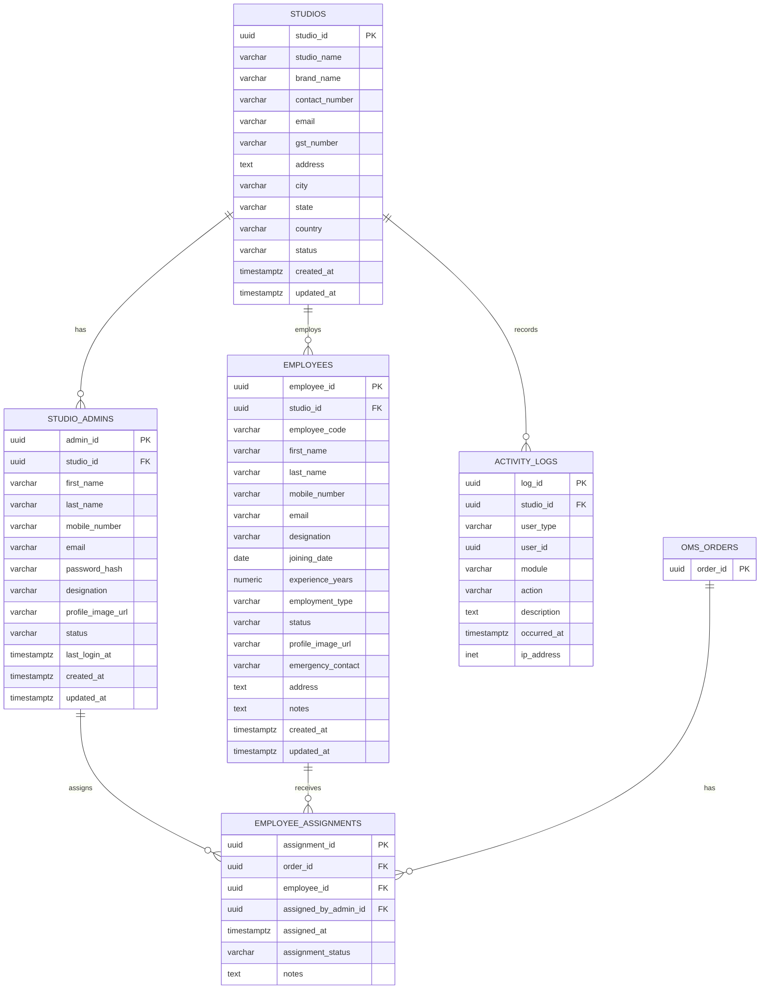

# FOCOMAN ERP Module Database Schema

Version: 1.0  
Status: Draft  
Database: PostgreSQL  
Application: Spring Boot + PostgreSQL

## Scope

The ERP module manages lightweight studio administration and employees for photography studios.

This schema intentionally excludes:

- Payroll
- Accounting
- Inventory
- Manufacturing
- Taxation
- HRMS

## Design Principles

- Normalized to 3NF.
- Multi-studio ready through `studio_id`.
- UUID primary keys for scalability and safer public references.
- No duplication of OMS or CRM records.
- OMS integration is handled through `employee_assignments.order_id`.
- Audit-friendly timestamps and activity logs.
- PostgreSQL check constraints are used instead of enums for easier future changes.

## ER Diagram



## PostgreSQL CREATE TABLE Script

See the standalone SQL file:

- `docs/technical/database/erp-schema.sql`

## Tables

### `erp.studios`

Represents each photography studio using Focoman.

Important constraints:

- `email` is unique when present.
- `gst_number` is unique when present.
- `status` is restricted to `ACTIVE`, `INACTIVE`, or `SUSPENDED`.

### `erp.studio_admins`

Represents studio owners and management users.

Supported designations:

- `OWNER`
- `CO_FOUNDER`
- `ADMIN`
- `MANAGER`

Important constraints:

- Each admin belongs to one studio.
- Email is unique within a studio.
- Mobile number is unique within a studio.
- Password is stored as `password_hash`, never as plain text.

### `erp.employees`

Represents operational team members.

Supported designations:

- `PHOTOGRAPHER`
- `VIDEOGRAPHER`
- `EDITOR`
- `ALBUM_DESIGNER`
- `RECEPTIONIST`
- `DRONE_OPERATOR`
- `FREELANCER`

Supported employment types:

- `FULL_TIME`
- `PART_TIME`
- `CONTRACT`
- `FREELANCE`

Important constraints:

- Employee code is unique within a studio.
- Mobile number is unique within a studio.
- Email is unique within a studio when present.
- Employees can view assigned work but cannot configure the studio.

### `erp.employee_assignments`

Stores which employee is assigned to which OMS order.

Important constraints:

- `employee_id` references `erp.employees`.
- `assigned_by_admin_id` references `erp.studio_admins`.
- `order_id` must reference `oms.orders(order_id)` once OMS schema is created.
- Duplicate active assignments for the same order and employee are prevented.

### `erp.activity_logs`

Stores security and business activity events.

Examples:

- Login
- Logout
- Order assignment
- Employee created
- Employee updated
- Studio settings changed

Important notes:

- `user_type` identifies whether the actor is a `STUDIO_ADMIN`, `EMPLOYEE`, `CUSTOMER`, or `SYSTEM`.
- `user_id` is polymorphic and should be validated at application level.
- `ip_address` uses PostgreSQL `inet`.

## Relationships

| Relationship | Type | Explanation |
| --- | --- | --- |
| `studios` to `studio_admins` | One-to-many | One studio can have multiple admins. |
| `studios` to `employees` | One-to-many | One studio can have many employees. |
| `studios` to `activity_logs` | One-to-many | Activity logs are scoped to a studio. |
| `studio_admins` to `employee_assignments` | One-to-many | Admins assign employees to orders. |
| `employees` to `employee_assignments` | One-to-many | Employees can be assigned to many orders. |
| `oms.orders` to `employee_assignments` | One-to-many | One order can have multiple assigned employees. |

## Index Strategy

Indexes are optimized for:

- Tenant-scoped lookups by `studio_id`.
- Login by `studio_id + email` or `studio_id + mobile_number`.
- Employee search by code, mobile, email, designation, and status.
- Order assignment lookup by `order_id`.
- Employee workload lookup by `employee_id`.
- Activity log filtering by studio, module, action, and timestamp.

## 3NF Normalization Notes

- Studio data is stored only in `studios`.
- Admin data is stored only in `studio_admins`.
- Employee data is stored only in `employees`.
- Order data is not duplicated in ERP; `employee_assignments` references OMS orders.
- Activity logs store event facts only and do not duplicate full user or entity records.
- Non-key columns depend on the key, the whole key, and nothing but the key.

## Spring Boot Notes

- Use `UUID` in Java entities for IDs.
- Use `OffsetDateTime` for `timestamptz`.
- Use `LocalDate` for `joining_date`.
- Use `BigDecimal` for `experience_years`.
- Use application enums for statuses and designations.
- Keep database check constraints aligned with Java enums.
- Add `@PrePersist` and `@PreUpdate`, or use Spring Data auditing for timestamps.

## OMS / CRM Integration

The ERP schema must not duplicate customer or order data.

Recommended integration points:

- `erp.employee_assignments.order_id` references `oms.orders(order_id)`.
- CRM customer references should remain in CRM tables.
- Reports should join ERP, OMS, and CRM by foreign keys or read models, not copied columns.

The SQL script assumes a future OMS table:

```sql
oms.orders(order_id uuid primary key)
```

If OMS is not created yet, apply the ERP tables first without the OMS foreign key, then add the FK after OMS schema is finalized.
