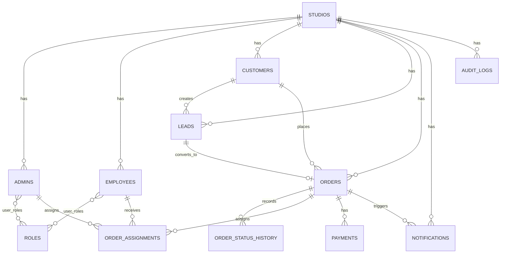

# FOCOMAN OMS-First PostgreSQL Schema

Version: 1.0  
Status: Draft  
Database: PostgreSQL  
Application: Spring Boot modular monolith

## Scope

This schema supports the first OMS implementation while keeping the database ready for future CRM and ERP modules.

The schema is intentionally simple:

- One PostgreSQL database.
- One main application schema: `focoman`.
- Multi-tenant support through `studio_id`.
- Business entities belong to a studio.
- OMS owns orders, assignments, payments, notifications, and order status history.
- Future CRM and ERP modules should reference shared tables instead of duplicating data.

## Primary Key Strategy

Use `uuid` primary keys consistently.

Reasons:

- Safer public references than sequential IDs.
- Better for future distributed systems and imports.
- Works well with Spring Boot using Java `UUID`.
- Avoids exposing order volume through URLs or APIs.

PostgreSQL uses `gen_random_uuid()` from `pgcrypto`.

## ER Diagram



## Tables

### `studios`

Represents a photography studio tenant.

### `admins`

Represents studio owners and management users. This replaces the generic `users` table for studio administration.

### `roles`

Stores reusable access roles, for example `STUDIO_OWNER`, `ADMIN`, `MANAGER`, `EMPLOYEE`, and `CUSTOMER`.

### `user_roles`

Maps a role to either an admin or an employee. The table supports both because admins and employees are separate concepts in FOCOMAN.

### `employees`

Represents operational studio staff.

### `customers`

Represents CRM-ready customer records.

### `leads`

Represents enquiries before order confirmation.

### `orders`

Central OMS table.

### `order_status_history`

Tracks status changes over time.

### `order_assignments`

Assigns employees to orders.

### `payments`

Tracks payment records for an order. This is payment tracking only, not accounting.

### `notifications`

Stores notification events and delivery state.

### `audit_logs`

Stores application activity for traceability.

## Relationships

| Relationship | Type | Notes |
| --- | --- | --- |
| `studios` to `admins` | One-to-many | One studio has owner/admin accounts. |
| `studios` to `employees` | One-to-many | One studio has operational staff. |
| `studios` to `customers` | One-to-many | Customers are tenant-scoped. |
| `customers` to `leads` | One-to-many | Customer may create multiple leads. |
| `customers` to `orders` | One-to-many | Customer may place multiple orders. |
| `leads` to `orders` | Optional one-to-one | A lead may convert into one order. |
| `orders` to `order_status_history` | One-to-many | Order timeline. |
| `orders` to `order_assignments` | One-to-many | Multiple employees can work on one order. |
| `employees` to `order_assignments` | One-to-many | Employee workload. |
| `orders` to `payments` | One-to-many | Multiple payments per order. |
| `orders` to `notifications` | One-to-many | Notification history. |

## Index Recommendations

- Add composite indexes beginning with `studio_id` for tenant-scoped queries.
- Add unique order number per studio.
- Add unique customer mobile per studio.
- Add unique employee code per studio.
- Add indexes for order status, event date, assigned employee, payment status, and notification status.
- Add descending timestamp indexes for timelines and audit logs.

## Suggested Flyway Migration Files

When database implementation starts, split this schema into:

```text
V1__create_base_identity_tables.sql
V2__create_people_tables.sql
V3__create_oms_tables.sql
V4__create_notification_and_audit_tables.sql
V5__create_indexes.sql
```

For now, keep this as a design document because the current OMS prototype uses mock data only.

## PostgreSQL Script

See:

- `docs/technical/database/oms-first-schema.sql`
